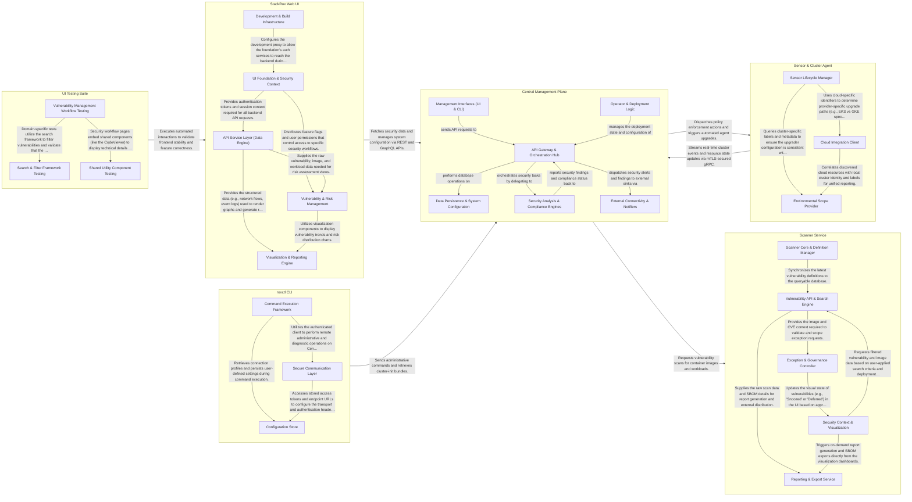

## Details

The StackRox architecture follows a Manager-Agent (Central-Sensor) pattern designed for multi-cluster Kubernetes security. The Central Management Plane acts as the brain of the system, handling data persistence, policy detection, and API orchestration. It communicates with Sensors deployed in secured clusters which monitor runtime activity and enforce policies. The Scanner Service provides specialized vulnerability analysis for container images, while users interact with the system via the StackRox Web UI or the roxctl CLI, both of which consume Central's APIs. The entire system is secured with mTLS and robust identity management to ensure safe cross-cluster communication.

### Central Management Plane

The core orchestration and data layer of StackRox. It manages the gRPC/HTTP API servers, the PostgreSQL database for persistence, and the central detection engine. It also handles identity provider integrations (OIDC/SAML) and the technical handshake logic for remote Sensors.

- **API Gateway & Orchestration Hub** — The central entry point and coordination engine for the subsystem.
- **Data Persistence & System Configuration** — The foundational data layer responsible for the persistence of all platform state.
- **Security Analysis & Compliance Engines** — Specialized engines that perform deep security analysis.
- **External Connectivity & Notifiers** — Manages all outbound communication from Central to external services.
- **Management Interfaces (UI & CLI)** — The user-facing layer of the platform, consisting of the React-based web console and the roxctl command-line tool.
- **Operator & Deployment Logic** — Handles the lifecycle and deployment of the Central Management Plane within Kubernetes.

### Sensor & Cluster Agent

The agent-side component deployed within each secured Kubernetes cluster. It manages the lifecycle of the local security stack, including cloud provider integrations and automated upgrades via the Sensor Upgrader.

- **Cloud Integration Client** — Manages authentication and communication with external cloud providers (AWS, GCP, Azure) to facilitate cluster discovery and metadata retrieval.
- **Sensor Lifecycle Manager** — Orchestrates the automated upgrade process and configuration management of the local Sensor stack.
- **Environmental Scope Provider** — Provides an abstraction layer for accessing Kubernetes-native metadata, such as cluster and namespace labels.

### Scanner Service

A specialized service dedicated to container image analysis and vulnerability management. It maintains its own update lifecycle for vulnerability definitions and provides scanning capabilities to Central.

- **Scanner Core & Definition Manager** — The foundational engine of the scanner, responsible for the lifecycle of vulnerability definitions and the operational health of the scanning service.
- **Vulnerability API & Search Engine** — The primary data access and processing layer that interfaces between the UI and the backend vulnerability database.
- **Exception & Governance Controller** — Manages the multi-step workflow for vulnerability exceptions, including deferrals and false positive markings.
- **Reporting & Export Service** — Handles the generation and distribution of security artifacts, including SBOMs and scheduled vulnerability reports.
- **Security Context & Visualization** — The presentation layer that contextualizes vulnerability data within the Kubernetes environment.

### roxctl CLI

The administrative command-line tool used for interacting with Central, managing configurations, and performing cluster initialization tasks.

- **Command Execution Framework** — Orchestrates the CLI lifecycle, including command hierarchy definition, flag parsing, and the execution of administrative tasks like database backups or diagnostics.
- **Secure Communication Layer** — Manages the low-level mechanics of interacting with the Central API.
- **Configuration Store** — Provides a persistence mechanism for roxctl local state, managing the storage and retrieval of Central endpoints and associated credentials in a YAML-based configuration file.

### StackRox Web UI

The React-based frontend application. It provides a comprehensive dashboard for security monitoring, network graphing, policy management, and vulnerability reporting. It includes its own session management and data-fetching engine.

- **UI Foundation & Security Context** — Provides the foundational environment for the application, including global state management, feature flagging, routing, and the security lifecycle (authentication, token management, and session persistence).
- **API Service Layer (Data Engine)** — The central data-fetching engine that abstracts gRPC and REST interactions with the StackRox Central API.
- **Vulnerability & Risk Management** — A specialized functional module focused on security posture, specifically managing CVEs (Common Vulnerabilities and Exposures) and the workflow for granting security exceptions or deferrals.
- **Visualization & Reporting Engine** — Handles complex data visualization requirements, including interactive network graphs, runtime event timelines, and the generation of downloadable PDF/CSV security reports.
- **Development & Build Infrastructure** — Contains the non-functional code required for the development environment, including proxy configurations for local API communication and global test setup utilities.

### UI Testing Suite

The Cypress-based testing framework used to validate the UI components and end-to-end user workflows.

- **Search & Filter Framework Testing** — Validates the core "Compound Search Filter" logic, which is the primary mechanism for data discovery in the platform.
- **Vulnerability Management Workflow Testing** — Tests end-to-end security workflows within the Vulnerability Management module.
- **Shared Utility Component Testing** — Focuses on the unit-level validation of reusable UI components that provide platform-wide utility, such as the CodeViewer for inspecting YAML configurations or policy definitions.

