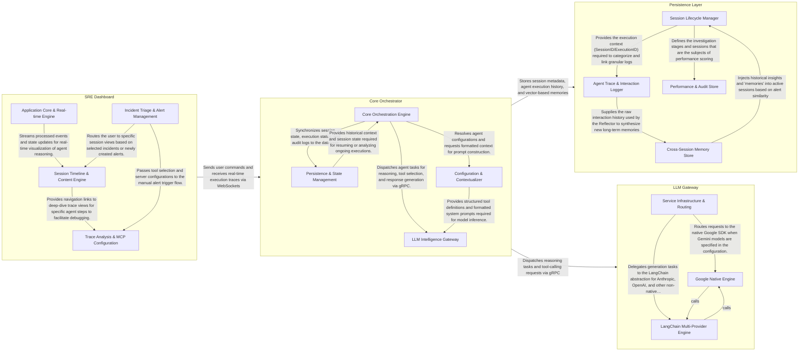

## Details

Tarsy is an agentic SRE platform designed to automate incident analysis and remediation. The system's workflow is centered around "Sessions," which are triggered by alerts or user requests from the SRE Dashboard. The Core Orchestrator (Go) manages these sessions by executing a chain of stages, each handled by specialized agents. These agents leverage the LLM Gateway (Python) for reasoning and tool-calling, while the Persistence Layer (Ent/Postgres) maintains the state of the analysis, logs agent interactions, and stores long-term memories for cross-session learning. The Orchestrator also integrates with external diagnostic and remediation tools via the Model Context Protocol (MCP). Real-time execution traces and agent "thinking" steps are streamed back to the dashboard via WebSockets, providing SREs with a transparent and interactive remediation experience.

### Core Orchestrator

The central Go-based engine that manages the lifecycle of incident analysis sessions. It handles API requests, manages a worker pool for parallel agent execution, and orchestrates complex workflows using the Model Context Protocol (MCP).

- **Core Orchestration Engine** — The primary execution engine that manages session lifecycles, worker allocation, and agent instantiation.
- **Persistence & State Management** — Manages the system's durable state using Ent ORM.
- **LLM Intelligence Gateway** — A gRPC-based bridge to the Python LLM service.
- **Configuration & Contextualizer** — Manages YAML-based agent definitions and formats execution context into structured prompts for the LLM Gateway.

### Persistence Layer

Manages the system's state and long-term memory using the Ent ORM and PostgreSQL. It stores alert sessions, agent execution logs, timeline events, and vector-based memories used for cross-session learning.

- **Session Lifecycle Manager** — Manages the structural "skeleton" of the system's state.
- **Agent Trace & Interaction Logger** — Acts as the "black box" recorder for the agentic workflow.
- **Cross-Session Memory Store** — Implements the "Reflector" system's storage layer.
- **Performance & Audit Store** — Manages the persistence of quality metrics and automated evaluation results.

### LLM Gateway

A Python-based microservice that abstracts interactions with various Large Language Models (Google Gemini, Anthropic, OpenAI). It provides a unified gRPC interface for the Go orchestrator, handling prompt construction and streaming responses.

- **Service Infrastructure & Routing** — Manages the gRPC server lifecycle and the central routing logic.
- **Google Native Engine** — A specialized provider that interacts directly with the Google Generative AI SDK.
- **LangChain Multi-Provider Engine** — Provides a unified interface for Anthropic, OpenAI, and other LLM backends using the LangChain framework.

### SRE Dashboard

A React-based frontend that provides SREs with a real-time view of incident analysis. It visualizes agent reasoning steps, tool executions, and final remediation summaries, allowing users to interact with the system via a chat interface.

- **Application Core & Real-time Engine** — Manages the React application lifecycle, authentication, and the critical WebSocket-driven event pipeline.
- **Incident Triage & Alert Management** — Provides the primary interface for SREs to monitor incoming incidents.
- **Session Timeline & Content Engine** — The central visualization component that transforms flat event streams into a hierarchical view of agent stages and tool executions.
- **Trace Analysis & MCP Configuration** — Facilitates advanced debugging and system setup.

