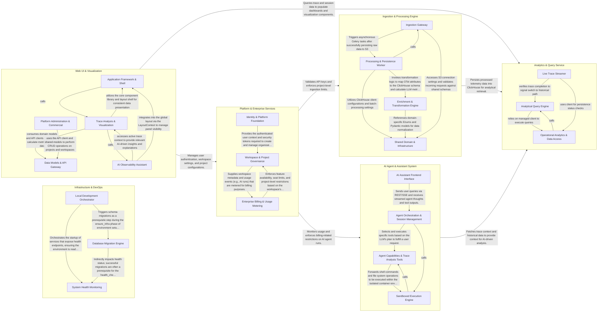

## Details

This system architecture represents a comprehensive observability and AI-driven analysis platform. The main flow begins with the ingestion of telemetry data, which is processed and stored in ClickHouse, followed by an analytical layer that serves this data to a web-based visualization interface and an AI-powered assistant system, all governed by a centralized platform and enterprise services layer for security, billing, and administration.

### Ingestion & Processing Engine

Handles the high-volume telemetry data flow, from receiving OTLP protobuf data via the public API to asynchronous processing and batch insertion into ClickHouse.

- **Ingestion Gateway** — Acts as the entry point for all external telemetry.
- **Processing & Persistence Worker** — The orchestration layer for background tasks.
- **Enrichment & Transformation Engine** — The domain-specific logic layer that normalizes generic OpenTelemetry spans into LLM-aware entities.
- **Shared Domain & Infrastructure** — Provides the foundational configuration and data structures used across the engine.

### Analytics & Query Service

The analytical read-path of the platform, responsible for executing complex ClickHouse queries to serve trace, session, and user data to the frontend.

- **Analytical Query Engine** — The core engine for historical data retrieval.
- **Live Trace Streamer** — Provides immediate visibility into traces currently being processed.
- **Operational Analytics & Data Access** — Manages the underlying infrastructure for data access and provides platform-level usage metrics.

### AI Agent & Assistant System

Orchestrates AI-driven workflows, combining backend agent execution in sandboxed environments with a frontend chat interface for interactive trace analysis.

- **AI Assistant Frontend Interface** — Manages the user-facing chat experience, including message input, model configuration, and real-time streaming of agent responses and execution traces.
- **Agent Orchestration & Session Management** — The "brain" of the subsystem that manages the lifecycle of AI agents, session persistence, token usage, and the core execution loop that processes LLM outputs.
- **Agent Capabilities & Trace Analysis Tools** — A collection of functional tools that the agent uses to interact with the external world and the platform's data, such as shell commands, git operations, and OTel trace queries.
- **Sandboxed Execution Engine** — Provides isolated environments (Docker, Daytona) for executing code and commands generated by the agent, managing lifecycle, resource cleanup, and process signals.

### Web UI & Visualization

The primary user interface for the platform, featuring specialized components for rendering hierarchical span trees and managing real-time trace updates.

- **Application Framework & Shell** — Provides the structural foundation and reusable UI primitives for the entire platform, managing global layout context and sidebar states.
- **Trace Analysis & Visualization** — The core engine for rendering complex hierarchical span trees, managing real-time trace updates, and synchronizing view state with the URL.
- **AI Observability Assistant** — An interactive, LLM-powered sidecar that provides contextual analysis of traces, managing streaming chat interfaces and specialized rendering for tool calls.
- **Data Models & API Gateway** — Defines shared domain models and provides the communication layer between frontend and backend services, including cost calculation and security-boundary API routes.
- **Platform Administration & Commercial** — Handles transactional aspects of the platform, including workspace membership, project settings, API key management, and billing.

### Platform & Enterprise Services

Manages the administrative control plane, including identity management, project/workspace configuration, and enterprise billing logic.

- **Identity & Platform Foundation** — Manages the user authentication lifecycle, social identity provider integrations (Google/GitHub), and the foundational infrastructure services that support the platform's administrative operations.
- **Workspace & Project Governance** — Handles the hierarchical management of workspaces and projects, including membership control, security settings (API keys), and the configuration of external LLM model providers.
- **Enterprise Billing & Usage Metering** — Defines enterprise plan logic and entitlements while executing background jobs to meter platform usage (via ClickHouse) and synchronize billing data with external payment processors.

### Infrastructure & DevOps

Provides the foundational tooling for environment setup, database migrations, and system-wide health monitoring.

- **Local Development Orchestrator** — Manages the end-to-end lifecycle of the local development environment.
- **Database Migration Engine** — Encapsulates the logic for evolving the ClickHouse database schema.
- **System Health Monitoring** — Defines the standard protocols for service health and readiness.

