```mermaid
graph LR
    Command_Line_Interface_CLI_["Command-Line Interface (CLI)"]
    Configuration_Manager["Configuration Manager"]
    Target_Resolver["Target Resolver"]
    Proxy_Management_System["Proxy Management System"]
    Attack_Execution_Engine["Attack Execution Engine"]
    HTTP_Network_Request_Handler["HTTP/Network Request Handler"]
    Attack_Modules["Attack Modules"]
    Command_Line_Interface_CLI_ -- "feeds user input to" --> Configuration_Manager
    Configuration_Manager -- "configures" --> Attack_Execution_Engine
    Configuration_Manager -- "configures" --> Proxy_Management_System
    Configuration_Manager -- "configures" --> Target_Resolver
    Configuration_Manager -- "configures" --> Attack_Modules
    Target_Resolver -- "provides processed target information to" --> Attack_Execution_Engine
    Proxy_Management_System -- "supplies validated proxies to" --> HTTP_Network_Request_Handler
    Attack_Execution_Engine -- "distributes attack tasks to" --> Attack_Modules
    Attack_Execution_Engine -- "provides processed target information to" --> Attack_Modules
    Attack_Modules -- "relies on" --> HTTP_Network_Request_Handler
    click Command_Line_Interface_CLI_ href "https://github.com/CodeBoarding/GeneratedOnBoardings/blob/main/MHDDoS/Command_Line_Interface_CLI_.md" "Details"
    click Configuration_Manager href "https://github.com/CodeBoarding/GeneratedOnBoardings/blob/main/MHDDoS/Configuration_Manager.md" "Details"
    click Target_Resolver href "https://github.com/CodeBoarding/GeneratedOnBoardings/blob/main/MHDDoS/Target_Resolver.md" "Details"
    click Proxy_Management_System href "https://github.com/CodeBoarding/GeneratedOnBoardings/blob/main/MHDDoS/Proxy_Management_System.md" "Details"
    click Attack_Execution_Engine href "https://github.com/CodeBoarding/GeneratedOnBoardings/blob/main/MHDDoS/Attack_Execution_Engine.md" "Details"
    click HTTP_Network_Request_Handler href "https://github.com/CodeBoarding/GeneratedOnBoardings/blob/main/MHDDoS/HTTP_Network_Request_Handler.md" "Details"
    click Attack_Modules href "https://github.com/CodeBoarding/GeneratedOnBoardings/blob/main/MHDDoS/Attack_Modules.md" "Details"
```

## Details

One paragraph explaining the functionality which is represented by this graph. What the main flow is and what is its purpose.

### Command-Line Interface (CLI) [[Expand]](./Command_Line_Interface_CLI_.md)
Provides the primary user interface for interacting with the tool, enabling users to select attack types, specify targets, and configure various attack parameters through command-line arguments. It translates raw user input into structured data.

**Related Classes/Methods**: _None_

### Configuration Manager [[Expand]](./Configuration_Manager.md)
Centralized management of all operational parameters. It loads, parses, and validates attack methods, targets, proxy settings, and concurrency levels from external sources (e.g., JSON, text files, CLI arguments), acting as the single source of truth for attack parameters.

**Related Classes/Methods**: _None_

### Target Resolver [[Expand]](./Target_Resolver.md)
Handles the preparation of target information, including resolving hostnames to IP addresses using DNS, processing lists of targets, and potentially implementing anti-DDoS bypass mechanisms like Cloudflare IP resolution to identify real server IPs.

**Related Classes/Methods**: _None_

### Proxy Management System [[Expand]](./Proxy_Management_System.md)
Manages the lifecycle of proxies to ensure anonymity and aid in bypassing anti-DDoS measures. It is responsible for loading, validating, rotating, and supplying proxies for network requests.

**Related Classes/Methods**: _None_

### Attack Execution Engine [[Expand]](./Attack_Execution_Engine.md)
Coordinates the overall attack execution flow, initializing and managing the concurrency for parallel and asynchronous execution of attack requests, and distributing attack tasks to specific attack modules based on configured parameters.

**Related Classes/Methods**: _None_

### HTTP/Network Request Handler [[Expand]](./HTTP_Network_Request_Handler.md)
Encapsulates the low-level logic for making actual network requests across different layers (HTTP, TCP, UDP, ICMP). It handles connection establishment, sending payloads, and receiving responses, serving as a foundational service for attack modules.

**Related Classes/Methods**: _None_

### Attack Modules [[Expand]](./Attack_Modules.md)
Implements specific application-layer (HTTP/HTTPS) and transport-layer (TCP/UDP/ICMP) DDoS attack methods. These modules construct and send attack payloads, relying on the HTTP/Network Request Handler for underlying network operations.

**Related Classes/Methods**: _None_

### [FAQ](https://github.com/CodeBoarding/GeneratedOnBoardings/tree/main?tab=readme-ov-file#faq)