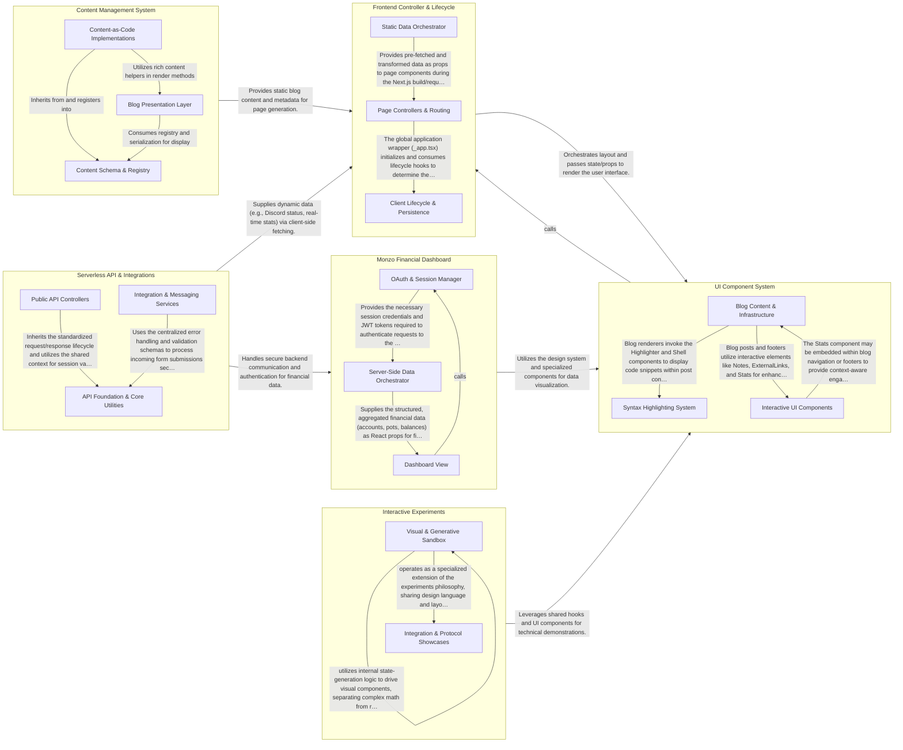

## Details

This architecture follows a modern Next.js pattern where a central Frontend Controller manages the application lifecycle and routing, orchestrating data from a static Content Management System and a dynamic Serverless API layer. The UI Component System provides a unified design language used across the main site, the Monzo Financial Dashboard, and various Interactive Experiments. Data flows from the Content and API layers into the Controllers, which then populate the UI components to render the final user experience, while specialized features like the Monzo dashboard maintain their own server-side data fetching logic.

### Frontend Controller & Lifecycle

Manages the high-level routing, page entry points, and client-side application state. It coordinates data fetching via Next.js lifecycle methods and tracks user persistence.

- **Page Controllers & Routing** — Acts as the primary entry point for all web requests, defining the layout and routing structure of the application.
- **Client Lifecycle & Persistence** — Manages client-side state that persists across sessions.
- **Static Data Orchestrator** — Handles the server-side logic for fetching and transforming content during the build process (SSG).

### UI Component System

The visual building blocks of the application, including reusable UI elements, blog-specific renderers, and syntax highlighters.

- **Blog Content & Infrastructure** — Manages the lifecycle of the blog, implementing the "Content-as-Code" pattern, including post registry, sorting/filtering logic, and navigational UI elements.
- **Syntax Highlighting System** — A specialized rendering engine for technical content, wrapping react-syntax-highlighter to provide consistent, themed code blocks with terminal simulations and file tabs.
- **Interactive UI Components** — Provides reusable, stateful UI elements like visit stats, animated message bubbles, and specialized links/notes, often integrating with custom hooks for animations or state.

### Content Management System

Implements the 'Content-as-Code' pattern, defining data structures for blog posts and handling the sorting and serialization of static content.

- **Content Schema & Registry** — Defines the foundational Post model and manages the lifecycle of all blog content, including serialization and registry orchestration.
- **Content-as-Code Implementations** — Contains individual blog post implementations as TypeScript classes that encapsulate their own logic and React render methods.
- **Blog Presentation Layer** — Responsible for the visual delivery of the blog, including navigation components and rich content helpers used by posts.

### Serverless API & Integrations

The backend layer of the monolithic repository, handling external API integrations (Discord, Apple Maps), OAuth flows, and contact form processing.

- **API Foundation & Core Utilities** — This component serves as the architectural backbone for all serverless operations.
- **Public API Controllers** — This component acts as the primary entry point for dynamic features and external authentication flows.
- **Integration & Messaging Services** — Dedicated to processing user-initiated communications, this component manages the flow of data from the site's contact form to external notification platforms.

### Monzo Financial Dashboard

A specialized, data-heavy feature that uses Server-Side Rendering (SSR) to fetch, format, and display financial transaction data.

- **OAuth & Session Manager** — Manages the security lifecycle of the Monzo integration, including OAuth 2.0 flow, token exchange, and JWT-based session persistence.
- **Server-Side Data Orchestrator** — Executes within the getServerSideProps lifecycle to fetch and aggregate financial data from the Monzo API for server-side rendering.
- **Dashboard View** — The presentation layer that renders aggregated financial data, handles currency formatting, and manages UI logic for different account types.

### Interactive Experiments

Isolated technical demonstrations and visual experiments, such as morphing shapes and OAuth demos, showcasing advanced frontend capabilities.

- **Visual & Generative Sandbox** — Manages the discovery and execution of visual experiments and local data processing tools.
- **Integration & Protocol Showcases** — Dedicated to functional demonstrations of third-party integrations.

