```mermaid
graph LR
  subgraph 1["Graph Logic Engine"]
    1__1_1["Graph Core & Registry"]
    1__1_2["Node Architecture & Widgets"]
    1__1_3["Subgraph & Promotion System"]
    1__1_4["Connectivity & Topology Math"]
    1__1_5["Canvas & Reactive State Bridge"]
    1__1_6["External Integration Adapter"]
    1__1_1 -->|"Instantiates and manages the lifecycle of nodes based on registered types."| 1__1_2
    1__1_2 -->|"Nodes provide the slot definitions and spatial bounds used to calculate link routing."| 1__1_4
    1__1_3 -->|"Subgraph nodes instantiate and manage internal LGraph instances for nested logic."| 1__1_1
    1__1_5 -->|"The canvas observes the graph state for rendering and dispatches user-driven structural changes to …"| 1__1_1
    1__1_5 -->|"Uses geometric utilities for hit-testing and manages the visual interaction of link dragging."| 1__1_4
    1__1_6 -->|"Serializes and deserializes graph data for storage and backend communication."| 1__1_1
    1__1_3 -->|"Extends base node functionality to support internal IO mapping and widget exposure."| 1__1_2
  end
  subgraph 2["Extension Framework"]
    2__2_1["Extension Registry & Lifecycle Hub"]
    2__2_2["Group Node & Template Manager"]
    2__2_3["Dynamic Widget & Node Logic"]
    2__2_4["Media & Specialized Extensions"]
    2__2_5["UI/UX Enhancement Layer"]
    2__2_1 -->|"triggers registration of group node definitions and template management hooks during initialization"| 2__2_2
    2__2_1 -->|"injects autogrow and type-matching behaviors into the core graph engine via extension hooks"| 2__2_3
    2__2_2 -->|"utilize dynamic widget logic to expose internal node inputs as external group-level widgets"| 2__2_3
    2__2_5 -->|"register themselves as extensions to hook into the global application state"| 2__2_1
    2__2_4 -->|"register custom node definitions and specialized widgets through lifecycle methods"| 2__2_1
    2__2_5 -->|"provides context menu options and dialogs to manage and edit group nodes and templates"| 2__2_2
  end
  subgraph 3["Canvas & Rendering System"]
    3__3_1["2D Canvas & Interaction Engine"]
    3__3_2["Collaborative Layout Store"]
    3__3_3["3D Visualization Engine"]
    3__3_2 -->|"Supplies synchronized node positions and link data for frame-by-frame rendering."| 3__3_1
    3__3_1 -->|"Triggers state mutations when users move nodes or create/delete links in the UI."| 3__3_2
    3__3_3 -->|"Integrates 3D previews into specific node widgets or canvas overlays."| 3__3_1
    3__3_1 -->|"Propagates viewport resize and visibility events to ensure 3D scenes align with the 2D layout."| 3__3_3
  end
  subgraph 4["Application Controller"]
    4__4_1["Application Lifecycle & Extension Manager"]
    4__4_2["API & Cloud Connectivity"]
    4__4_3["Workflow & Graph Orchestration"]
    4__4_4["Node & Asset Resource Manager"]
    4__4_1 -->|"Initiates backend connection and dispatches prompts"| 4__4_2
    4__4_1 -->|"Commands graph engine to load/reset workflows"| 4__4_3
    4__4_3 -->|"Queries node definitions and asset metadata"| 4__4_4
    4__4_2 -->|"Streams node definitions and handles media assets"| 4__4_4
    4__4_1 -->|"Triggers discovery and search indexing"| 4__4_4
  end
  subgraph 5["User Interface Shell"]
    5__5_1["Diagnostic & Side Panel Logic"]
    5__5_2["Workflow Builder & Orchestration"]
    5__5_3["Execution Queue UI"]
    5__5_4["Atomic UI Framework"]
    5__5_5["UI Validation Fixtures"]
    5__5_2 -->|"utilizes shared search and categorization logic for node placement and validation"| 5__5_1
    5__5_1 -->|"correlate execution errors with specific jobs in the queue to provide context-aware feedback"| 5__5_3
    5__5_3 -->|"renders queue items and progress bars using base UI components and design system tokens"| 5__5_4
    5__5_1 -->|"uses popups and buttons for error reporting and resolution actions"| 5__5_4
    5__5_2 -->|"employs dialogs and wizard steps built on the atomic framework"| 5__5_4
    5__5_5 -->|"supplies complex graph scenarios to test error grouping and reporting logic"| 5__5_1
  end
  subgraph 6["Platform & Distribution"]
    6__6_1["Desktop Platform Core"]
    6__6_2["Desktop Setup & Maintenance UI"]
    6__6_3["Marketing Website Platform"]
    6__6_1 -->|"Streams real-time terminal output and maintenance task progress to the UI for user feedback."| 6__6_2
    6__6_2 -->|"Triggers system-level operations such as cache clearing, environment resets, and installation execu…"| 6__6_1
    6__6_3 -->|"Provides the initial platform detection logic that determines which desktop distribution and instal…"| 6__6_1
  end
  4 -->|"Orchestrates graph lifecycle and workflow execution"| 1
  4 -->|"Provides reactive state and API data for UI display"| 5
  4 -->|"Manages the registration and loading of plugins"| 2
  1 -->|"Provides structural data for visual representation"| 3
  2 -->|"Injects custom node types and widget behaviors"| 1
  5 -->|"Triggers workflow actions and configuration changes"| 4
  3 -->|"Synchronizes user-driven layout and link changes"| 1
  6 -->|"Initializes the application within native or web environments"| 4
```

## Details

ComfyUI is a node-based generative AI interface where the Application Controller acts as the central orchestrator, managing the lifecycle of workflows and communication with the backend API. The Graph Logic Engine maintains the structural integrity of the node graph, which is visually represented and manipulated through the Canvas & Rendering System. The Extension Framework allows for dynamic modification of graph behavior, while the User Interface Shell provides the surrounding controls and diagnostic feedback. The entire system is delivered via the Platform & Distribution layer, supporting both web and desktop environments.

### Graph Logic Engine

Manages the structural and mathematical representation of the node graph, including nested subgraphs and core node lifecycle.

- **Graph Core & Registry** — Acts as the central kernel of the engine, managing the global registry of node types and the top-level orchestration of graph instances.
- **Node Architecture & Widgets** — Defines the internal structure and lifecycle of individual nodes, including their input/output slots and embedded interactive widgets.
- **Subgraph & Promotion System** — Manages the encapsulation of complex logic into nested subgraph nodes.
- **Connectivity & Topology Math** — Provides the mathematical and structural logic for links between nodes.
- **Canvas & Reactive State Bridge** — The visual controller and state synchronization layer.
- **External Integration Adapter** — Handles the boundary between the graph engine and the rest of the application, including persistence via the Workspace API and localization of node metadata.

### Extension Framework

Provides the mechanism for community and core plugins to extend the graph's functionality with custom nodes and dynamic widgets.

- **Extension Registry & Lifecycle Hub** — The central orchestrator that manages the registration and lifecycle of all extensions, providing hooks for logic injection and environment-specific integrations.
- **Group Node & Template Manager** — Manages the encapsulation of multiple nodes into reusable units, handling group definitions, widget mapping, and template storage.
- **Dynamic Widget & Node Logic** — Implements reactive behavior for node widgets, dynamic port creation (autogrow), type-matching, and specialized utility nodes.
- **Media & Specialized Extensions** — A suite of extensions for handling non-standard data types like Audio, 3D models, and live Webcam streams, managing state and custom rendering.
- **UI/UX Enhancement Layer** — Refines user interface and interaction patterns, including global clipboard management, context menu filtering, and mobile touch support.

### Canvas & Rendering System

Handles the visual output of the graph, including 2D canvas rendering, 3D model previews, and reactive layout synchronization.

- **2D Canvas & Interaction Engine** — Manages the visual output and user interaction logic for the node-based graph.
- **Collaborative Layout Store** — Serves as the authoritative source of truth for the graph's layout and connectivity.
- **3D Visualization Engine** — A specialized extension built on Three.js that provides 3D rendering capabilities within the graph.

### Application Controller

The central hub for application state, backend communication, workflow management, and cross-cutting services.

- **Application Lifecycle & Extension Manager** — Manages the high-level boot sequence, global application state, and the plugin architecture.
- **API & Cloud Connectivity** — Handles all bidirectional communication between the frontend and external environments, including WebSocket/REST connections to the backend and cloud-based services.
- **Workflow & Graph Orchestration** — Acts as the bridge between logical workflow data and the visual representation on the canvas, managing subgraphs and workflow state persistence.
- **Node & Asset Resource Manager** — Responsible for the discovery and management of nodes and media assets, providing search, organization, and pipeline services for assets.

### User Interface Shell

The reactive UI layer surrounding the canvas, providing side panels, toolbars, and diagnostic feedback based on the design system.

- **Diagnostic & Side Panel Logic** — Centralizes the logic for the right-side panel, including node/widget searching and the identification and grouping of workflow errors.
- **Workflow Builder & Orchestration** — Manages the state and multi-step transitions of the "Builder" interface, facilitating guided workflow creation and persistence.
- **Execution Queue UI** — Provides real-time feedback on the backend execution state, including job progress estimation and virtualized queue rendering.
- **Atomic UI Framework** — The foundational layer of the UI, containing both legacy class-based components and modern Vue 3 design system elements with their documentation.
- **UI Validation Fixtures** — Provides the necessary mock data and graph structures to validate UI behavior and integration with the Litegraph engine.

### Platform & Distribution

Manages the deployment and environment-specific logic for the Electron desktop app and the marketing website.

- **Desktop Platform Core** — Provides the foundational logic for the Electron environment, including environment detection, terminal management, and the execution engine for system-level maintenance tasks.
- **Desktop Setup & Maintenance UI** — Manages the user interface for the desktop installation wizard and the maintenance dashboard.
- **Marketing Website Platform** — Orchestrates the marketing website's content structure and interactive features.

