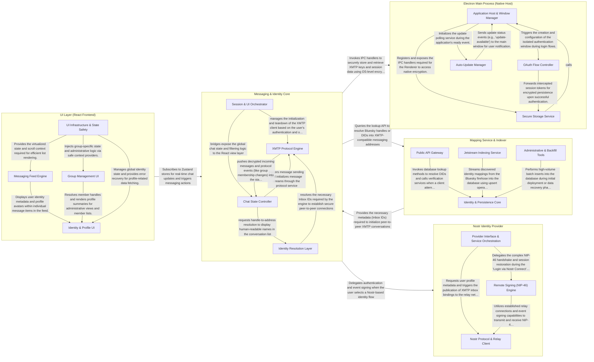

## Details

The application architecture is a multi-layered system designed for secure, cross-protocol messaging. It centers on a Renderer-based 'Messaging & Identity Core' that orchestrates XMTP messaging and identity resolution, supported by an Electron main process for secure native storage, a React UI layer for user interaction, a Nostr provider for alternative identity, and a backend mapping service for Bluesky-to-XMTP address resolution. The flow involves the UI reacting to state changes in the core, which in turn interacts with native services, external identity providers, and remote indexers to facilitate seamless peer-to-peer communication.

### Electron Main Process (Native Host)

The foundational layer running in the Node.js environment. It manages the application lifecycle, window orchestration, and provides secure native services to the renderer process. Its primary responsibility is the "Secure Storage" bridge, ensuring that sensitive cryptographic keys are never exposed to the standard web environment.

- **Application Host & Window Manager** — The central coordinator of the Main process.
- **Secure Storage Service** — Implements the "Secure Storage" bridge by wrapping Electron's safeStorage API.
- **OAuth Flow Controller** — Manages the specialized lifecycle of authentication windows.
- **Auto-Update Manager** — A background service that monitors for new application versions.

### Messaging & Identity Core

The central engine of the application residing in the Renderer process. It orchestrates the XMTP messaging protocol, manages the global application state (Auth, Chat, Onboarding), and coordinates identity resolution between Bluesky and XMTP. It acts as the primary controller for the entire user session.

- **XMTP Protocol Engine** — The low-level transport and security layer responsible for the XMTP client lifecycle.
- **Identity Resolution Layer** — Implements the mapping logic that bridges the social layer (Bluesky/ATProto) with the messaging layer (XMTP).
- **Chat State Controller** — The primary orchestrator of messaging data, utilizing Zustand for global state management.
- **Session & UI Orchestrator** — Manages the high-level application environment, including the onboarding flow, user settings, and authentication state.

### UI Layer (React Frontend)

The visual interface of the application, built with React and Tailwind CSS. It handles complex view logic such as virtualized message lists, group administration, and profile management. It is designed to be highly reactive, reflecting real-time updates from the underlying messaging streams.

- **Messaging Feed Engine** — Manages the high-performance rendering of chat messages using virtualization.
- **Group Management UI** — Provides the interface for managing group chat memberships, metadata, and administrative actions.
- **Identity & Profile UI** — Handles the display and management of user profiles, social graphs, and identity verification.
- **UI Infrastructure & State Safety** — Provides the structural backbone for the React application, including safe context creation for the Provider Pattern and error boundaries for application resilience.

### Nostr Identity Provider

A specialized module that implements the Nostr protocol for identity and remote signing. It allows users to use Nostr as an alternative identity layer, handling NIP-46 remote signing sessions and managing the binding between Nostr pubkeys and XMTP messaging identities.

- **Provider Interface & Service Orchestration** — Acts as the primary facade for the Nostr subsystem, implementing the standard `IdentityProvider` interface to decouple the main application from Nostr-specific logic.
- **Remote Signing (NIP-46) Engine** — Dedicated to the NIP-46 (Nostr Connect) protocol, this component enables secure authentication without exposing private keys to the application.
- **Nostr Protocol & Relay Client** — The low-level data access and networking layer responsible for raw communication with the Nostr network.

### Mapping Service & Indexer

A backend infrastructure component (Cloudflare Worker) that indexes the Bluesky firehose (Jetstream). It maintains a performant SQLite/D1 database mapping DIDs to XMTP Inbox IDs, providing a REST API for the client to resolve handles to messaging addresses.

- **Public API Gateway** — The external-facing interface of the Cloudflare Worker.
- **Identity & Persistence Core** — The central logic hub responsible for database interactions and protocol-specific identity verification.
- **Jetstream Indexing Service** — An active background worker that maintains a persistent connection to the Bluesky Jetstream firehose.
- **Administrative & Backfill Tools** — A suite of maintenance utilities used for cold-starting the database and performing bulk migrations.

