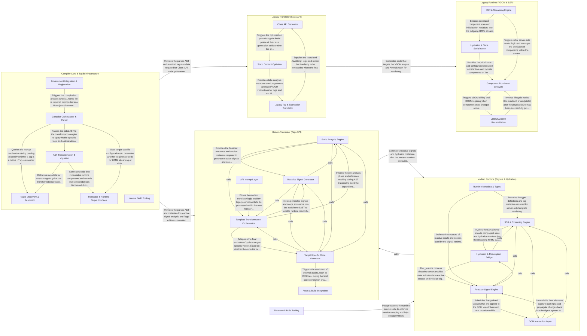

## Details

Marko's architecture is defined by a sophisticated build-time compiler that bridges the gap between high-level template syntax and optimized runtime execution. The Compiler Core serves as the central orchestrator, utilizing a Taglib System to resolve components and a Babel-based parser to generate an Abstract Syntax Tree (AST). Depending on the component style used, the flow bifurcates: the Legacy Class-API Pipeline transforms templates into VDOM-based render functions for the Legacy Runtime, while the Modern Tags-API Pipeline performs deep static analysis to generate fine-grained reactive "signals" for the Modern Runtime. This dual-path architecture allows Marko to provide a seamless transition from traditional VDOM rendering to a modern, signal-based reactive model with optimized partial hydration.

### Compiler Core & Taglib Infrastructure

The entry point for the Marko compilation process. It handles template parsing, manages the Taglib lookup mechanism for component discovery, and provides the shared Babel transformation infrastructure used by all translators.

- **Compiler Orchestrator & Parser** — The entry point for the compilation process, managing the MarkoFile state and using a Babel-based parser to convert Marko template syntax into a traversable AST.
- **Taglib Discovery & Resolution** — Scans the file system for marko.json definitions and custom components, building a TaglibLookup structure for resolving tag names.
- **AST Transformation & Migration** — Implements core logic for manipulating the Marko AST, including Babel visitors for attribute directives, syntax migration, and static analysis.
- **Environment Integration & Registration** — Handles integration into the execution environment, including Node.js require hooks, hot-reloading, and source map management.
- **Translator & Runtime Target Interface** — Bridges the compiler and runtime, providing dependency analysis utilities and defining target structures for HTML or VDOM generation.
- **Internal Build Tooling** — Internal scripts and utilities for maintaining infrastructure, such as generating TypeScript definitions from Babel types and managing package field overrides.

### Legacy Translator (Class API)

A specialized translation layer for Marko 4/5 (Class API). it converts template structures into JavaScript classes and VDOM-compatible render functions, applying optimizations for static content.

- **Class API Generator** — Serves as the primary orchestrator for the translation process, defining the structural skeleton of the generated JavaScript component and transforming template-level class blocks and lifecycle declarations into a formal class definition.
- **Legacy Tag & Expression Translator** — Handles the granular translation of Marko-specific tags and legacy syntax patterns, bridging the gap between the declarative template language and the imperative JavaScript required by the Class API.
- **Static Content Optimizer** — Implements performance-critical optimizations by analyzing the template's AST to identify and mark static nodes for optimized VDOM creation paths.

### Legacy Runtime (VDOM & SSR)

The execution engine for Class-API components. It manages the component lifecycle, handles server-side HTML streaming via AsyncStream, and performs client-side DOM updates using a VDOM morphing algorithm.

- **SSR & Streaming Engine** — Manages the asynchronous generation and flushing of HTML from the server to the client.
- **Component Runtime & Lifecycle** — The central management unit for component instances.
- **VDOM & DOM Reconciliation** — Provides the Virtual DOM infrastructure and the reconciliation logic used for client-side updates.
- **Hydration & State Serialization** — Facilitates the transfer of component state and metadata from the server to the client.

### Modern Translator (Tags API)

The advanced compiler for Marko 6 (Tags API). It performs sophisticated data-flow analysis to track variable references and template sections, generating reactive bindings instead of traditional VDOM logic.

- **Static Analysis Engine** — The "brain" of the translator; it performs data-flow analysis to identify variable references, create bindings, and organize the template into logical sections for reactive updates.
- **Reactive Signal Generator** — Translates static analysis metadata into executable runtime instructions, generating the "signals" and scope accessors that replace Virtual DOM diffing logic.
- **Template Transformation Orchestrator** — Manages the structural transformation of the Marko AST, orchestrating the traversal and dispatching translation tasks for control flow and custom tags.
- **Target-Specific Code Generator** — Adapts the translation output for specific environments (DOM vs.
- **API Interop Layer** — Facilitates the coexistence of the legacy Class API (Marko 5) and the new Tags API (Marko 6) by detecting features and merging translator visitors.
- **Asset & Build Integration** — Handles peripheral compiler tasks such as resolving associated style files and providing utilities for build-time size and performance analysis.

### Modern Runtime (Signals & Hydration)

A high-performance reactive runtime that uses a "Signal" system for fine-grained DOM updates. It includes a specialized serializer for efficient partial hydration, allowing the client to resume state from server-rendered HTML without re-rendering.

- **SSR & Streaming Engine** — Manages the server-side rendering lifecycle, focusing on streaming HTML generation and asynchronous fragment management.
- **Hydration & Resumption Bridge** — Acts as the link between server and client.
- **Reactive Signal Engine** — The core reactive runtime that manages the dependency graph between data and UI.
- **DOM Interaction Layer** — Provides low-level utilities for mutating the browser DOM.
- **Runtime Metadata & Types** — A collection of TypeScript definitions and metadata that define the contract between the compiler and the runtime, ensuring type safety for HTML tags and Marko-specific templates.

### Framework Build Tooling

Internal build-time utilities and plugins used to manage the Marko monorepo. These tools handle tasks like declaration hoisting and debug instrumentation during the framework's own build process.

