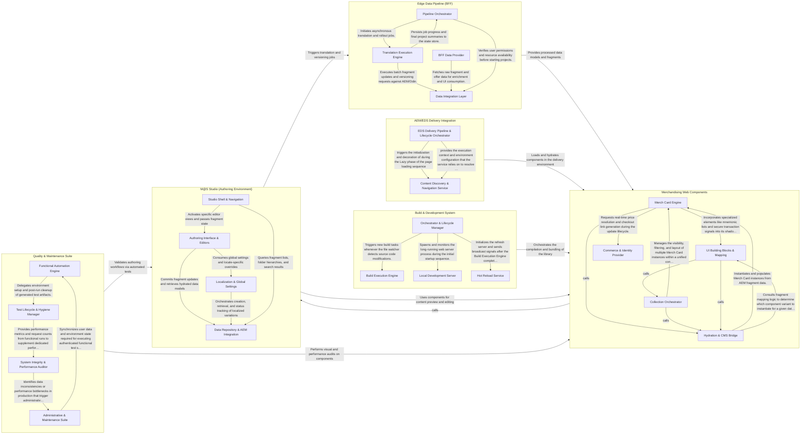

## Details

The M@S (Merchandising-as-a-Service) architecture is a high-performance content delivery and management ecosystem built on the Adobe stack. It features a clear separation between the authoring environment (M@S Studio), the data processing pipeline (Edge Data Pipeline), and the presentation layer (Merchandising Web Components). Content is authored in the Studio using a standardized data model, processed and versioned through an asynchronous Edge pipeline, and delivered via Lit-based web components that are hydrated in the AEM/EDS environment for optimal performance.

### M@S Studio (Authoring Environment)

The central authoring interface where users manage merchandising content, edit fragments, and coordinate translations. It utilizes a rich text editor (ProseMirror) and manages complex state through a repository pattern and reactive stores.

- **Studio Shell & Navigation** — The primary application container and orchestration layer.
- **Authoring Interface & Editors** — The workspace for content manipulation, integrating rich text editing with specialized property editors for merchandising.
- **Data Repository & AEM Integration** — Implements the Repository Pattern for fragment CRUD operations, bulk publishing, and AEM integration.
- **Localization & Global Settings** — Manages content localization, translation workflows, and global merchandising configuration settings.

### Edge Data Pipeline (BFF)

A backend-for-frontend layer that handles heavy data operations, translation project lifecycles, and versioning locks. It transforms raw AEM data into standardized models consumed by both the Studio and the Web Components.

- **Pipeline Orchestrator** — Manages the lifecycle of translation projects from initiation to completion.
- **Translation Execution Engine** — The core processing unit that executes translation and rollout logic.
- **Data Integration Layer** — Provides a standardized abstraction for interacting with external AEM and Odin services.
- **BFF Data Provider** — Tailors raw AEM data for the Studio UI.

### Merchandising Web Components

A library of Lit-based web components (cards, prices, buttons) used to render merchandising content. It integrates with commerce services (WCS) and handles hydration of static content for performance.

- **Merch Card Engine** — The core rendering engine for individual merchandising units.
- **Hydration & CMS Bridge** — Responsible for the "hydration" of server-rendered or static HTML into interactive web components.
- **Collection Orchestrator** — Manages groups of Merch Cards, providing high-level features such as filtering, sorting, and search.
- **Commerce & Identity Provider** — Handles integration with external Adobe services (WCS and IMS).
- **UI Building Blocks & Mapping** — Contains standalone UI elements (mnemonics, secure transaction icons) and the mapping logic that bridges AEM data structures to specific component implementations.

### AEM/EDS Delivery Integration

Integration scripts and blocks for Adobe Experience Manager (AEM) and Edge Delivery Services (EDS). It manages the delivery context, decorates blocks, and ensures components are correctly loaded in the production environment.

- **EDS Delivery Pipeline & Lifecycle Orchestrator** — Manages the Edge Delivery Services (EDS) page lifecycle, orchestrating the transition from initial request to fully interactive page.
- **Content Discovery & Navigation Service** — Responsible for generating the site's navigational structure by interacting with the EDS content index.

### Quality & Maintenance Suite

Automated testing frameworks (Nala/Playwright) and maintenance scripts for auditing data health, refreshing users, and validating system integrity across the Studio and Web Components.

- **Functional Automation Engine** — The core execution engine for end-to-end testing, combining low-level browser interaction utilities with high-level Page Objects.
- **Test Lifecycle & Hygiene Manager** — Manages the global state and observability of the functional test suite.
- **System Integrity & Performance Auditor** — A suite of tools focused on the health of the delivered content.
- **Administrative & Maintenance Suite** — A collection of operational scripts used for routine system maintenance.

### Build & Development System

Infrastructure for the development environment, including build orchestration with esbuild, file watching, and local development servers for the component library.

- **Orchestrator & Lifecycle Manager** — The central controller of the development environment.
- **Build Execution Engine** — Responsible for executing the transformation of source code into distributable web components.
- **Local Development Server** — A persistent background process that hosts the component library and documentation locally.
- **Hot Reload Service** — Provides real-time browser synchronization.

