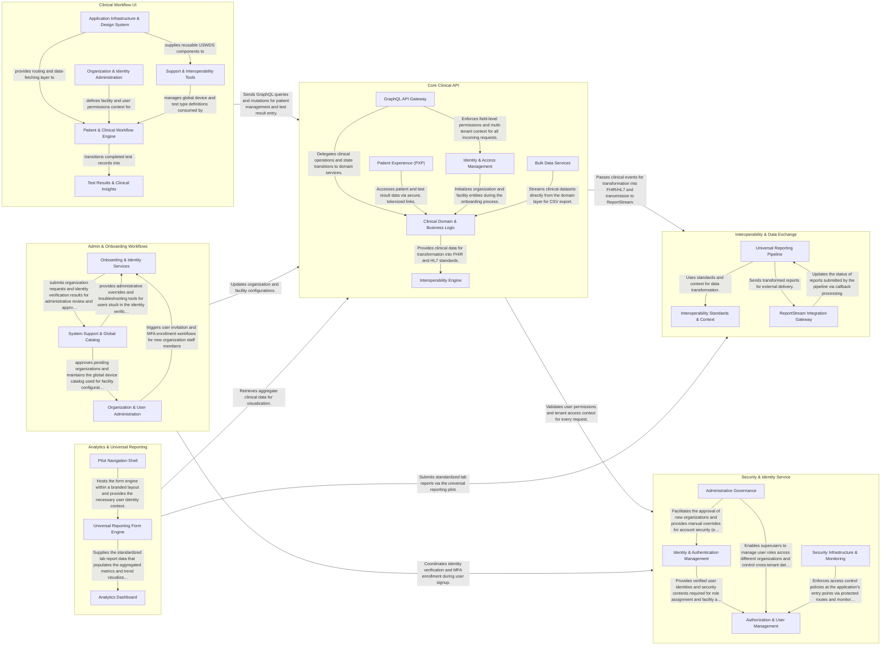

## Details

The `prime-simplereport` system is a modular monolith healthcare interoperability hub that bridges a React-based frontend with a Spring Boot backend. It is organized into six logical components—Core Clinical API, Interoperability & Data Exchange, Security & Identity Service, Clinical Workflow UI, Admin & Onboarding Workflows, and Analytics & Universal Reporting—which collectively manage clinical data, ensure regulatory compliance through data standardization, enforce fine-grained security, and provide administrative and analytical tools for healthcare organizations.

### Core Clinical API

The central backend engine managing clinical data entities (patients, facilities, test orders) via a GraphQL API. It handles business logic, data persistence, and domain-specific exceptions, serving as the primary source of truth for clinical operations.

- **GraphQL API Gateway** — The primary entry point for the web application, coordinating complex mutations and queries across clinical entities like patients, facilities, and test orders.
- **Clinical Domain & Business Logic** — The core engine managing the state and lifecycle of patients, facilities, and test orders, governed by strict clinical validation rules and data retention policies.
- **Interoperability Engine** — Responsible for translating internal domain models into standardized healthcare formats (FHIR/HL7) for public health reporting and external integrations.
- **Identity & Access Management** — Manages the security context, multi-tenant isolation, and the onboarding workflow for new clinical organizations, including identity verification and MFA.
- **Patient Experience (PXP)** — A specialized, token-based access layer for patient-facing interactions such as self-registration and unauthenticated test result retrieval.
- **Bulk Data Services** — REST-based controllers designed for high-volume data export and reporting, bypassing the GraphQL layer to stream clinical datasets directly to users.

### Interoperability & Data Exchange

A dedicated layer for healthcare data standards (FHIR, HL7 v2). It transforms internal models into interoperable formats and manages communication with external public health nodes like CDC's ReportStream, ensuring compliance with federal reporting requirements.

- **Interoperability Standards & Context** — Provides the foundational metadata, constants, and processing context required for healthcare data standards.
- **Universal Reporting Pipeline** — Acts as the primary ingestion and transformation engine for clinical data.
- **ReportStream Integration Gateway** — Manages the outbound communication and inbound feedback loop with the CDC's ReportStream platform.

### Security & Identity Service

Manages authentication, authorization, and system health. It integrates with Okta for identity management and provides custom GraphQL directives to enforce fine-grained access control based on user roles and organization membership.

- **Identity & Authentication Management** — Handles the initial onboarding of organizations and the security posture of individual user accounts.
- **Authorization & User Management** — Manages the internal organizational structure, defining roles and facility-level access permissions.
- **Administrative Governance** — Provides high-privilege tools for system administrators to perform cross-tenant operations, approve pending organizations, and provide support functions like MFA resets or user impersonation for troubleshooting.
- **Security Infrastructure & Monitoring** — The foundational layer that provides telemetry, system health monitoring, and core security routing logic.

### Clinical Workflow UI

The primary React-based user interface for clinicians and staff. It manages the test queue, patient management, and facility dashboards, utilizing Apollo Client for state management and backend synchronization.

- **Application Infrastructure & Design System** — Provides the foundational framework, routing, and visual language for the entire application.
- **Patient & Clinical Workflow Engine** — The core operational hub where clinicians manage the lifecycle of a testing encounter.
- **Test Results & Clinical Insights** — Manages the post-testing phase, providing clinicians with a searchable history of results and actionable clinical guidance.
- **Organization & Identity Administration** — Handles the governance and security context of the application.
- **Support & Interoperability Tools** — A high-privilege module used for system-wide maintenance and data interoperability.

### Admin & Onboarding Workflows

Manages the lifecycle of organizations and users, including multi-step signup processes, identity verification, and administrative tools for managing facilities, device types, and user permissions.

- **Onboarding & Identity Services** — Handles the "front door" logic, including organization signup, Experian-based identity proofing, and the user activation/MFA flow for invited staff.
- **Organization & User Administration** — Provides administrative interfaces for active organizations to manage their internal structure, including facility metadata (CLIA numbers, addresses), user roles, and permissions.
- **System Support & Global Catalog** — Facilitates system-wide administration by CDC or support staff, including the review of pending organizations and maintenance of the global registry of supported testing devices.

### Analytics & Universal Reporting

Provides specialized reporting tools and data visualizations. It includes the 'Universal Reporting' pilot for lab results and high-level analytics dashboards for monitoring testing trends across organizations.

- **Universal Reporting Form Engine** — Manages the complex, multi-step manual reporting workflow for the Universal Reporting pilot.
- **Pilot Navigation Shell** — Provides the specialized navigation framework and federal branding for the Universal Reporting pilot.
- **Analytics Dashboard** — Provides high-level data visualizations and monitoring tools for tracking testing trends across organizations.

